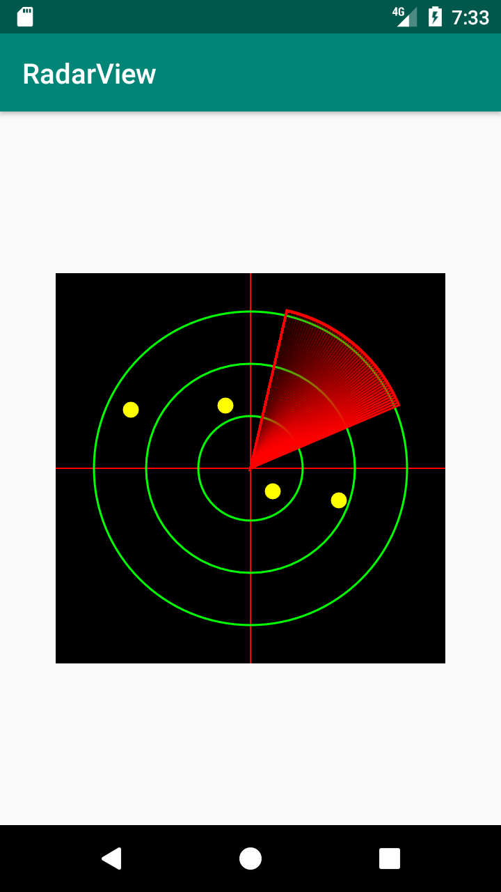
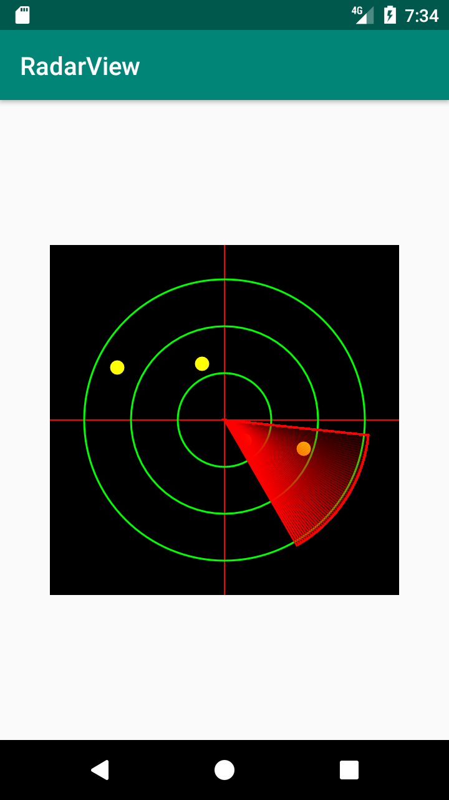

This is just sample application, which provide a simple idea to render RadarView component.

```
activity_main.xml

    <com.dpdlad.radarview.RadarView
        android:id="@+id/symmetricStarViewOriginal1"
        android:layout_width="wrap_content"
        android:layout_height="wrap_content"
        android:layout_margin="@dimen/margin_large"
        app:layout_constraintBottom_toBottomOf="parent"
        app:layout_constraintLeft_toLeftOf="parent"
        app:layout_constraintRight_toRightOf="parent"
        app:layout_constraintTop_toTopOf="parent" />
 ```

# Sample Demo:




